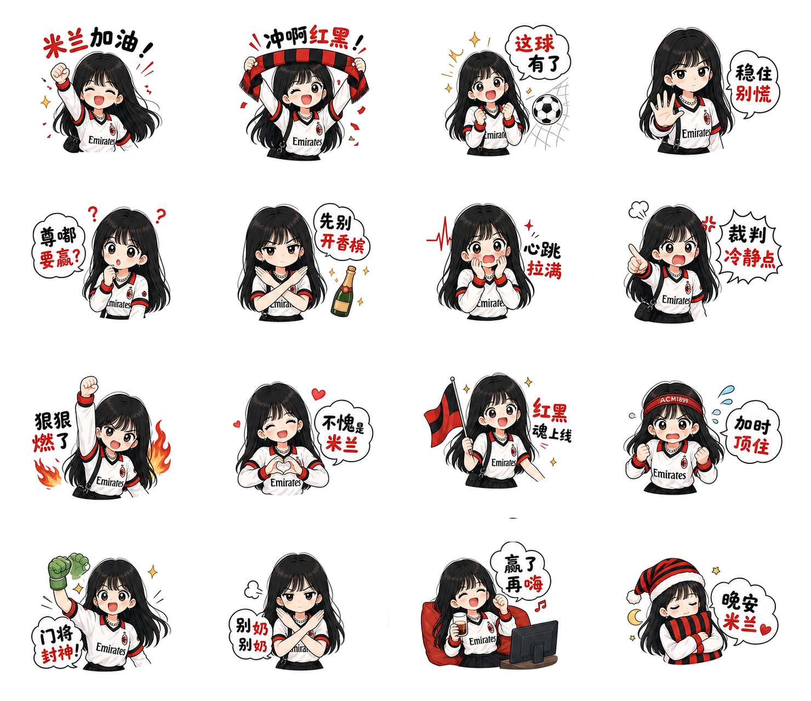

# LINE Sticker Set Skill

Codex skill for `表情包制作`: generate a 16-piece LINE-style sticker sheet from an uploaded character/theme photo and a scene description, then slice it into transparent PNG stickers.

## What it does

- References a user-uploaded character or theme image.
- Generates a 4x4 sticker sheet with strict invisible-cell safe margins.
- Uses Chinese sticker dialogue for everyday chat.
- Removes the white background and exports 16 transparent PNG stickers.
- Builds a contact sheet for quick review.

## Install

Copy this folder into your Codex skills directory:

```bash
cp -R line-sticker-set ~/.codex/skills/
```

Then use the wake phrase:

```text
表情包制作，去海边
```

Upload a reference image with the request.

## Main Files

- `SKILL.md` - skill trigger and workflow
- `references/prompt-template.md` - generation prompt template and phrase bank
- `scripts/slice_sticker_sheet.py` - 4x4 sheet slicer and transparent PNG exporter

## Examples


### 表情包制作，米兰加油



### 表情包制作，去海边，不要太多颜色，不要太花


